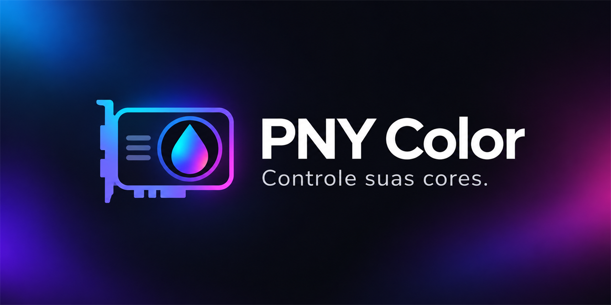

# PNY Color

Controlador independente de iluminação para a **PNY RTX 3080 Ti UPRISING**, com cores próprias, efeitos e integração local com o SignalRGB.

## Baixar a versão 2.1

- **[Instalador completo](https://github.com/Duduzinxz/PNY-Color/releases/download/v2.1.0/PNY-Color-Completo-2.1.0.exe)** — recomendado para instalar no Windows.
- **[Executável portátil](https://github.com/Duduzinxz/PNY-Color/releases/download/v2.1.0/PNY-Color-Portatil-2.1.0.exe)** — pode ser copiado sozinho.
- **[Todos os arquivos da versão](https://github.com/Duduzinxz/PNY-Color/releases/tag/v2.1.0)** — inclui código-fonte e hashes SHA-256.

A ponte SignalRGB está embutida no executável e é instalada ou reparada automaticamente. Não é necessário copiar o plugin manualmente.

## Como usar

1. Instale o driver oficial NVIDIA para a placa.
2. Se quiser sincronização, instale o SignalRGB separadamente.
3. Feche versões anteriores do PNY Color e execute o instalador completo ou o portátil.
4. No PNY Color, selecione **SignalRGB → Usar ponte local**, se necessário.
5. Reinicie o SignalRGB após a primeira instalação. A placa aparecerá como **PNY RTX 3080 Ti — ponte local** em Outros dispositivos.

Mantenha o PNY Color aberto, inclusive na bandeja, para receber as cores. O modo SignalRGB salvo é retomado ao abrir. A inicialização com o Windows é opcional em Preferências. Para usar somente uma cor própria, selecione Cor única e clique em Aplicar e salvar; use branco 0 para cores RGB puras.

## Compatibilidade e limites

| Item | Requisito |
| --- | --- |
| Sistema | Windows 10/11 de 64 bits, com .NET Framework disponível |
| Placa validada | PNY RTX 3080 Ti UPRISING, PCI `220810DE / 1384196E` |
| Driver | Driver oficial NVIDIA com NVAPI |
| Sincronização | SignalRGB instalado separadamente |

**A pulsação já existente da placa não foi corrigida pela versão 2.1.** Preto e brilho zero retomam o ciclo de fábrica; não desligam os LEDs. Os efeitos são experimentais. O instalador não inclui o driver NVIDIA nem o aplicativo SignalRGB.

O aplicativo não altera BIOS, clocks, tensão ou ventoinhas. A ponte se comunica somente em `127.0.0.1:39841`. Preferências e log ficam em `%APPDATA%/PNYColor`; o plugin fica em Documentos/WhirlwindFX/Plugins.

## Desenvolvimento

Execute `build.ps1` no PowerShell para compilar. Para gerar o instalador, use `build-installer.ps1 -Compiler <caminho-do-ISCC.exe>` com Inno Setup 6.7.3. Os arquivos necessários do projeto estão neste repositório.

`PnyColor.exe --self-test` executa verificações sem escrever na GPU. A versão foi testada com o executável isolado, instalação/desinstalação em quatro idiomas e recuperação automática do plugin. Não foi testada em uma máquina virtual recém-formatada.

Veja [instruções completas](PNY-Color-LEIA-ME.md) e [validação da versão](VALIDACAO-2.1.md).

Projeto independente, sem afiliação com PNY, NVIDIA ou SignalRGB. Interfaces NVAPI baseadas na [documentação e nos cabeçalhos públicos da NVIDIA](https://github.com/NVIDIA/nvapi).
